  <h3 align="center">Push Web Android Application</h3>
  
  

    Aplikacja webowa pozwalająca na wysyłanie powiadomień typu push 
     
    <a href="https://push-web-application.herokuapp.com/">Aplikacja webowa</a>
    ·
    <a href="https://sebastiankulig.github.io/PushWebApplication/">Dokumentacja aplikacji webowej</a>
    ·
    <a href="https://github.com/karolwn/push_app">Aplikacja mobilna</a>
     ·
    <a href="https://karolwn.github.io/push_app/">Dokumentacja aplikacji mobilnej</a>

  

<!-- TABLE OF CONTENTS -->

  
Spis treści

  <ol>
    <li>
      <a href="#o-projekcie">O projekcie</a>
    </li>
    <li>
      <a href="#architektura">Architektura</a>
    </li>
    <li><a href="#użyte-technologie">Użyte technologie</a></li>
  </ol>

<!-- ABOUT THE PROJECT -->
## O projekcie
Aplikacja pozwala na rejestrowanie użytkowników w usłudze Firebase Cloud Messaging, subskrybowanie na konkretne topici oraz obsługa powiadomień push wysłanych z aplikacji web tj. odbiór oraz odpowiedź.

Ekran startowy aplikacji
 
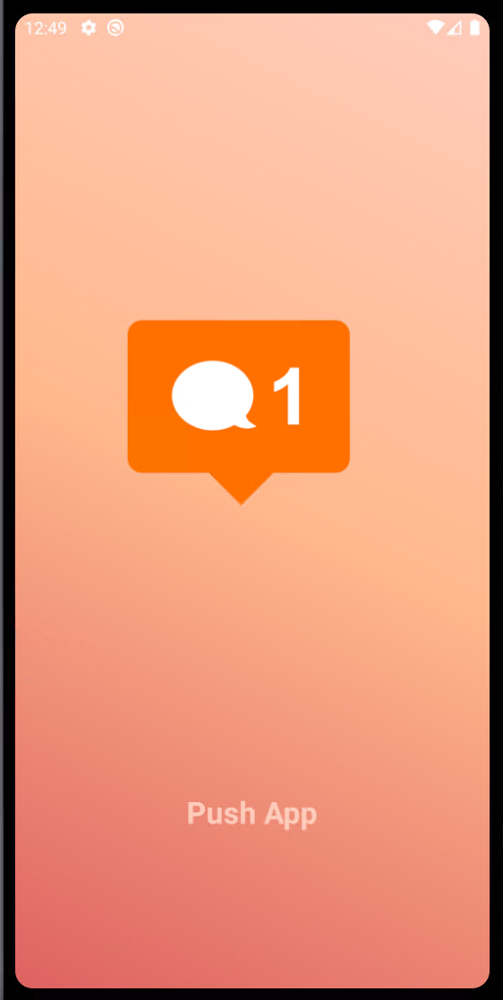

Ekran logowania. Użytkownik ma opcję logowania poprzez adres email lub jako gość.
 
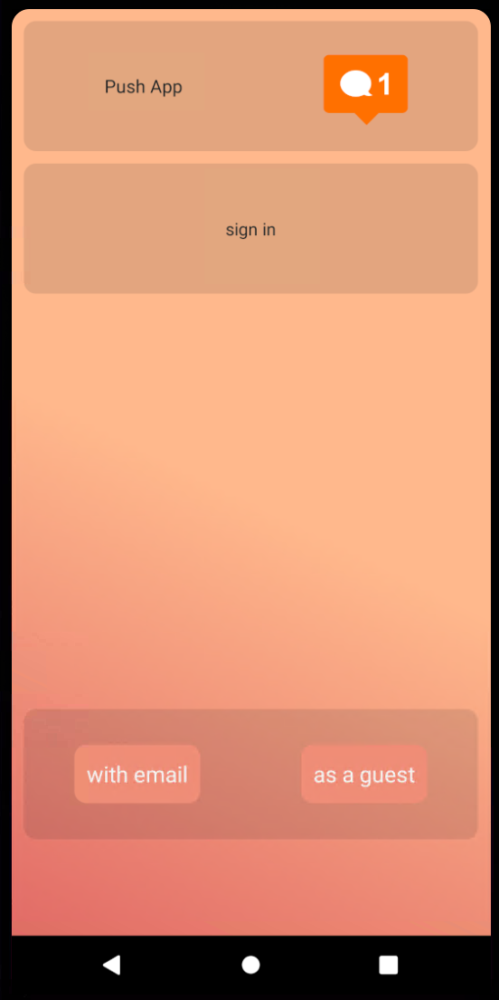

Tworzenie nowego użytkownika  
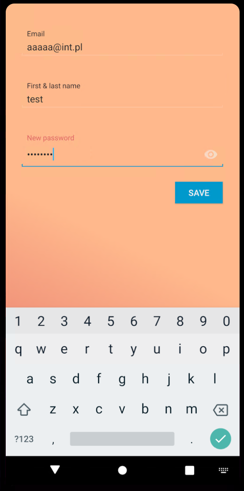

Logowanie na istniejące konto. 
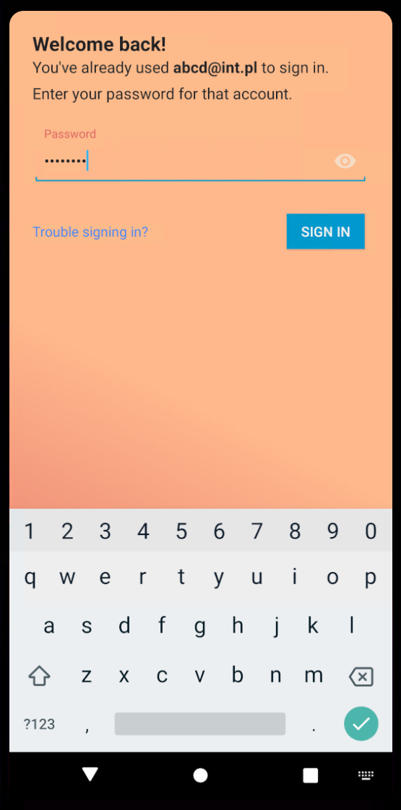

Ekran główny aplikacji. 
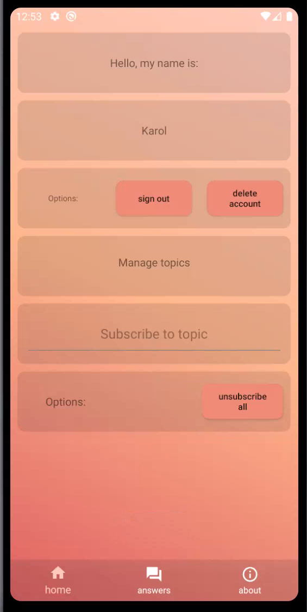

Ekran z formularzem odpowiedzi. 
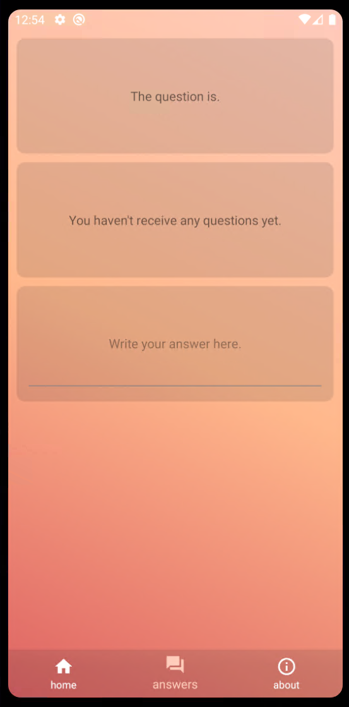

Ekran z informacjami o aplikacji. 
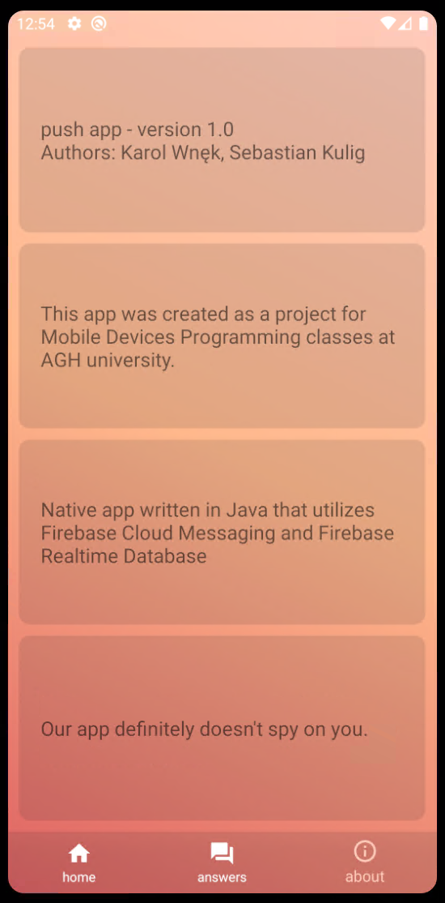

Popup potwierdzający usunięcie konta. 
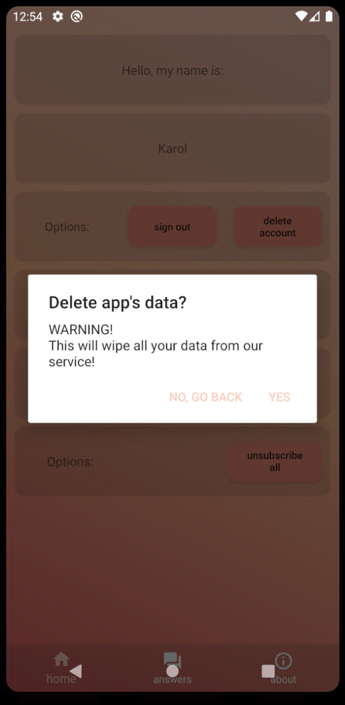

Odebrane powiadomienie. 
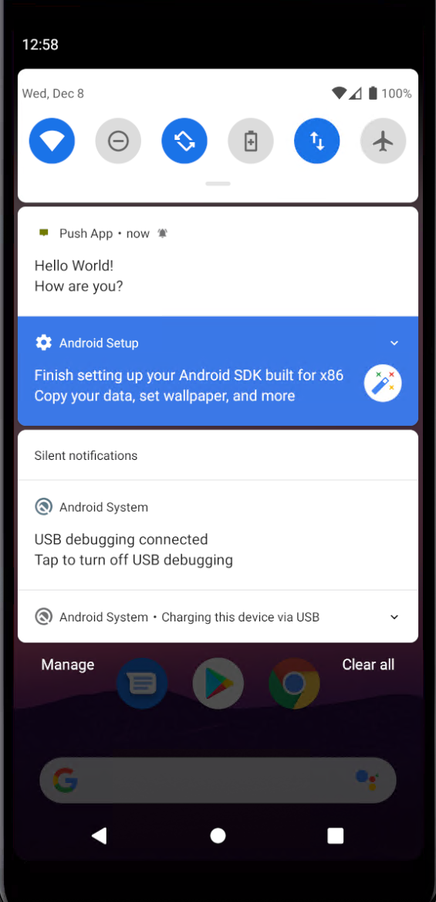

Zaktualizowany ekran odpowiedzi. 
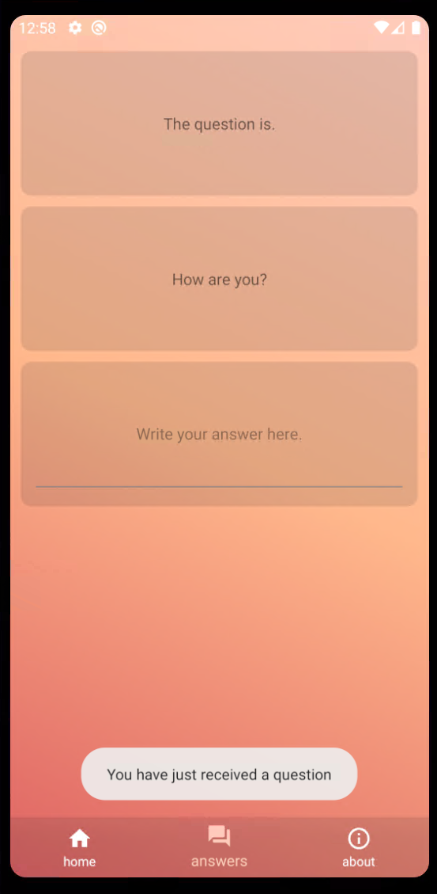

## Architektura
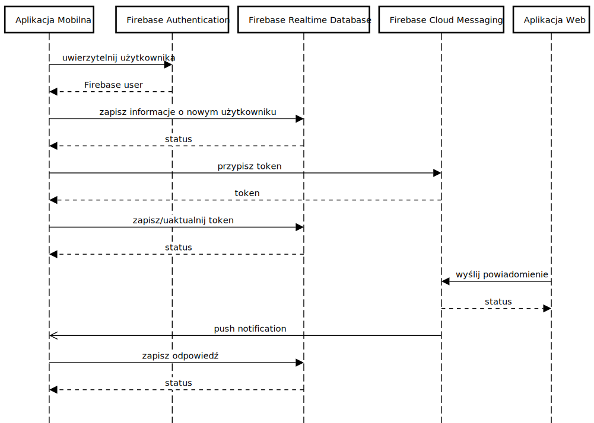

### Użyte technologie
- Java 8
- Firebase Authentication
- Firebase Realtime Database
- Firebase Cloud Messaging
- Android SDK, API 29
